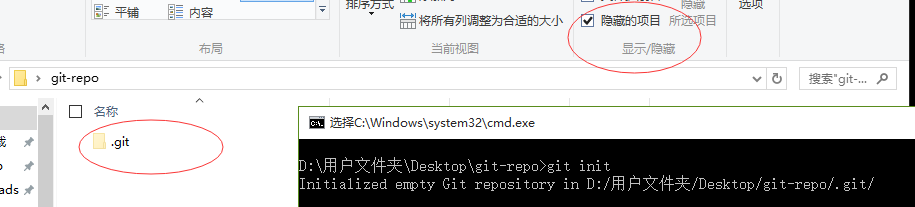
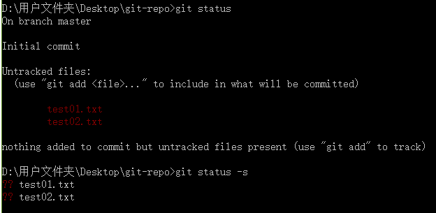
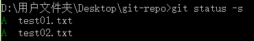
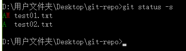
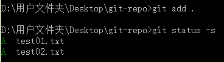
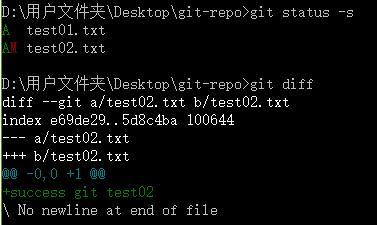
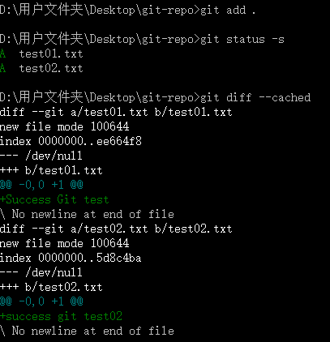
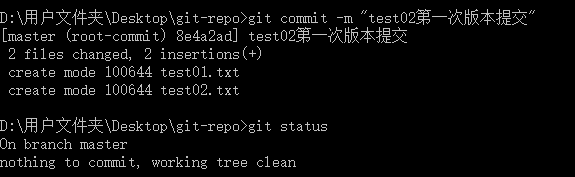

# Git基本操作

Git 的工作就是创建和保存你项目的快照及与之后的快照进行对比

## 获取与创建项目命令

**git init**

用 git init 在目录中创建新的 Git 仓库。 你可以在任何时候、任何目录中这么做，完全是本地化的

在目录中执行该命令就可以了,比如我们创建"git-repo"的仓库.进入该目录中执行:

~~~
git init
~~~

现在你可以看到在你的项目中生成了 .git 这个子目录。 这就是你的 Git 仓库了，所有有关你的此项目的快照数据都存放在这里。

## 基本快照

### 1. git add

​      git add 命令可将该文件添加到缓存

​      在git-repo目录中新建俩个文件test01.txt和test02.txt

​     **然后执行`git status`来查看项目的当前状态或git status -s 以精简的方式显示当前项目的状态**

​    

​    接下来用git add命令俩添加这俩个文件:语法:​    

    ~~~
git add filename
    ~~~

或者同时添加多个文件

~~~
git add filename1 filename2
~~~

执行:

~~~
git add test01.txt test02.txt
~~~

现在我们再执行 git status，就可以看到这两个文件已经加上去了

 

新项目中，添加所有文件很普遍，我们可以使用 **git add .** 命令来添加当前项目的所有文件。

在test01.txt添加以下内容：**Success Git test**，然后保存退出。

再次执行git status查看项目的状态:

 

`"AM" 状态的意思是，这个文件在我们将它添加到缓存之后又有改动。改动后我们再执行 git add 命令将其添加到缓存中：`

 

### 2. git status

git status 以查看在你上次提交之后是否有修改。

我演示该命令的时候加了 -s 参数，以获得简短的结果输出。如果没加该参数会详细输出内容

### 3. git diff

执行 git diff 来查看执行 git status 的结果的详细信息。

git diff 命令显示已写入缓存与已修改但尚未写入缓存的改动的区别。git diff 有两个主要的应用场景。

- 尚未缓存的改动：**git diff** 

- 查看已缓存的改动： **git diff --cached** 

- 查看已缓存的与未缓存的所有改动：**git diff HEAD** 

- 显示摘要而非整个 diff：**git diff --stat** 

**在test02.txt文件中添加如下内容:**

> success git test02

 

git status 显示你上次提交更新后的更改或者写入缓存的改动， 而 git diff 一行一行地显示这些改动具体是啥。

接下来我们来查看下 git diff --cached 的执行效果：

 

### 4. git commit

使用 git add 命令将想要快照的内容写入缓存区，  而执行 git commit 将缓存区内容添加到仓库中。

Git 为你的每一个提交都记录你的名字与电子邮箱地址，所以第一步需要配置用户名和邮箱地址。

~~~
$ git config --global user.name 'guancgsuccess'
$ git config --global user.email '849962874@qq.com'
~~~

接下来我们写入缓存，并提交对test02.txt的所有改动。在首个例子中，我们使用 -m 选项以在命令行中提供提交注释:

 

以上输出说明我们在最近一次提交之后，没有做任何改动，是一个"working directory clean：干净的工作目录"。

如果你没有设置 -m 选项，Git 会尝试为你打开一个编辑器以填写提交信息。

补充:

`我们可以使用git commit -am "add and commit "来替代先git add 后 git commit操作`

### 5. git reset HEAD

git reset HEAD 命令用于取消已缓存的内容。

