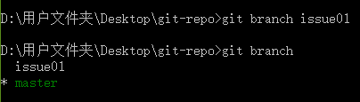
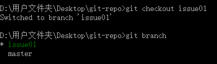
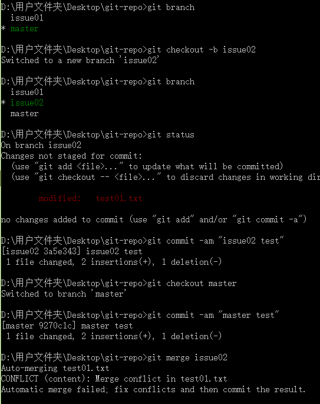

# Git分支管理

几乎每一种版本控制系统都以某种形式支持分支。使用分支意味着你可以从开发主线上分离开来，然后在不影响主线的同时继续工作。 有人把 Git 的分支模型称为"必杀技特性"，而正是因为它，将 Git 从版本控制系统家族里区分出来。

创建分支命令：

~~~
git branch (branchname)
~~~

切换分支命令:

~~~
git checkout (branchname)
~~~

当你切换分支的时候，Git 会用该分支的最后提交的快照替换你的工作目录的内容， 所以多个分支不需要多个目录。

合并分支命令:

~~~
git merge 
~~~

你可以多次合并到统一分支， 也可以选择在合并之后直接删除被并入的分支。

## 列出分支

1. **列出分支**

   ~~~
   git branch
   ~~~

   没有参数时，git branch 会列出你在本地的分支。

   >D:\用户文件夹\Desktop\git-repo>git branch
   >
   >*master

   此例的意思就是，我们有一个叫做"master"的分支，并且该分支是当前分支。 

   当你执行 git init 的时候，缺省情况下 Git 就会为你创建"master"分支。

2. **创建分支**

   ~~~
   git branch branchname
   ~~~

    

3. **切换分支**

     

我们也可以使用 git checkout -b (branchname)  命令来创建新分支并立即切换到该分支下，从而在该分支中操作。使用分支将工作切分开来，从而让我们能够在不同上下文中做事，并来回切换。

4.  **删除分支**

   ~~~
   git branch -d (branchname)
   ~~~

5. **分支合并**

   一旦某分支有了独立内容，你终究会希望将它合并回到你的主分支。 你可以使用以下命令将任何分支合并到当前分支中去：

   ~~~
   
   D:\用户文件夹\Desktop\git-repo>git branch
   * issue01
     master
   
   D:\用户文件夹\Desktop\git-repo>git status
   On branch issue01
   nothing to commit, working tree clean
   
   D:\用户文件夹\Desktop\git-repo>git checkout master
   Switched to branch 'master'
   
   D:\用户文件夹\Desktop\git-repo>git status
   On branch master
   nothing to commit, working tree clean
   
   D:\用户文件夹\Desktop\git-repo>dir
    驱动器 D 中的卷是 软件
    卷的序列号是 000D-927B
   
    D:\用户文件夹\Desktop\git-repo 的目录
   
   2018/12/28 周五  15:01    <DIR>          .
   2018/12/28 周五  15:01    <DIR>          ..
   2018/12/28 周五  14:46                29 test01.txt
   2018/12/28 周五  14:46                31 test02.txt
   2018/12/28 周五  15:01                 0 test03.txt
                  3 个文件             60 字节
                  2 个目录 57,683,222,528 可用字节
   
   D:\用户文件夹\Desktop\git-repo>git checkout issue01
   Switched to branch 'issue01'
   
   D:\用户文件夹\Desktop\git-repo>dir
    驱动器 D 中的卷是 软件
    卷的序列号是 000D-927B
   
    D:\用户文件夹\Desktop\git-repo 的目录
   
   2018/12/28 周五  15:01    <DIR>          .
   2018/12/28 周五  15:01    <DIR>          ..
   2018/12/28 周五  14:46                29 test01.txt
   2018/12/28 周五  14:46                31 test02.txt
   2018/12/28 周五  15:01                 0 test03.txt
                  3 个文件             60 字节
                  2 个目录 57,683,222,528 可用字节
   
   D:\用户文件夹\Desktop\git-repo>git branch
   * issue01
     master
   
   D:\用户文件夹\Desktop\git-repo>git add .
   
   D:\用户文件夹\Desktop\git-repo>git commit -m "delete test03.txt"
   [issue01 59709db] delete test03.txt
    1 file changed, 0 insertions(+), 0 deletions(-)
    delete mode 100644 test03.txt
   
   D:\用户文件夹\Desktop\git-repo>dir
    驱动器 D 中的卷是 软件
    卷的序列号是 000D-927B
   
    D:\用户文件夹\Desktop\git-repo 的目录
   
   2018/12/28 周五  15:28    <DIR>          .
   2018/12/28 周五  15:28    <DIR>          ..
   2018/12/28 周五  14:46                29 test01.txt
   2018/12/28 周五  14:46                31 test02.txt
                  2 个文件             60 字节
                  2 个目录 57,683,222,528 可用字节
   
   D:\用户文件夹\Desktop\git-repo>git checkout master
   Switched to branch 'master'
   
   D:\用户文件夹\Desktop\git-repo>git merge issue01
   Updating 7de4007..59709db
   Fast-forward
    test03.txt | 0
    1 file changed, 0 insertions(+), 0 deletions(-)
    delete mode 100644 test03.txt
   
   D:\用户文件夹\Desktop\git-repo>dir
    驱动器 D 中的卷是 软件
    卷的序列号是 000D-927B
   
    D:\用户文件夹\Desktop\git-repo 的目录
   
   2018/12/28 周五  15:29    <DIR>          .
   2018/12/28 周五  15:29    <DIR>          ..
   2018/12/28 周五  14:46                29 test01.txt
   2018/12/28 周五  14:46                31 test02.txt
                  2 个文件             60 字节
                  2 个目录 57,683,197,952 可用字节
   
   D:\用户文件夹\Desktop\git-repo>
   ~~~

   以上实例中我们将issue01 分支合并到主分支去，test02.txt 文件被删除。

   6. **合并冲突**

      合并并不仅仅是简单的文件添加、移除的操作，Git 也会合并修改。

      模拟分支合并冲突场景:

      `新建一个新的分支,并且切换过去:`

      ~~~
      git checkout -b issue02
      ~~~

      修改test01.txt中的内容:

      > issue02...

      执行

      ~~~
      git commit -am 'changed the test01.txt'
      ~~~

   将修改的内容提交到 "issue02" 分支中。 现在，假如切换回 "master" 分支我们可以看内容恢复到我们修改前的，我们再次修改test01.txt文件.并且提交,此时再合并issue02一个合并冲突就出现了，接下来我们需要手动去修改它。

   ​	**具体操作如下:**

   ​	

   此时,打开test01.txt文件,内容如下:

   ~~~
   Success Git test
   test01 head
   <<<<<<< HEAD
   master...
   =======
   issue02...
   >>>>>>> issue02
   ~~~

   在master分支上手动修改之后提交.